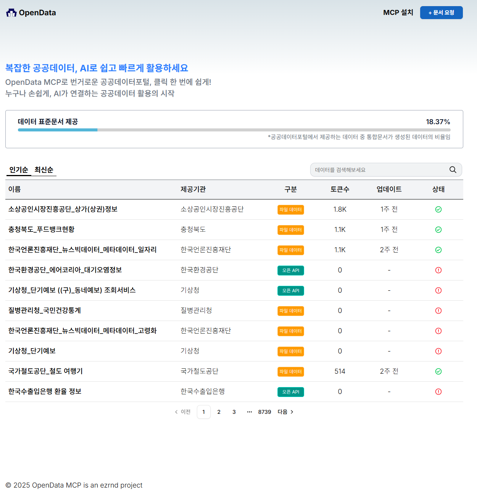

## OpenDataMCP Web

공공데이터포털 데이터를 쉽고 빠르게 탐색·활용할 수 있도록 돕는 웹 클라이언트입니다. 목록/검색/정렬/페이지네이션을 제공하고, 상세 페이지에서 표준 문서(Markdown)를 열람·복사하며, 신규 문서 생성을 요청할 수 있습니다.



### 주요 기능

- **데이터 탐색**: 인기/최신 정렬, 검색, 페이지네이션으로 데이터 목록 조회
- **상세 보기**: 기관/허가/키워드 등 메타데이터, 설명 표시 및 표준 문서(Markdown) 뷰어 제공, 링크 복사/공유
- **요청/진행 관리**: 신규 URL 제출로 문서 생성 요청, 생성 상태/성공률 진행률 바 표시

### 동작 구조

1. **목록 조회**: `GET /api/v1/document/v2`로 페이지·정렬·검색어에 따른 목록을 가져와 테이블에 렌더링합니다.
2. **상세 조회**: 항목 클릭 시 `GET /api/v1/document/std-docs/{slug}`로 상세/문서를 가져옵니다.
3. **문서 요청**: 상세에서 또는 요청 페이지에서 `POST /api/v1/document/save-request`로 생성 요청을 보냅니다.
4. **진행률 표시**: `GET /api/v1/document/success-rate`로 표준 문서 생성 성공률을 가져와 Progress에 표시합니다.

### 기술 스택

- **Framework**: Next.js 15, React 19
- **UI**: Tailwind CSS 4, Radix UI
- **데이터**: TanStack React Query 5, TanStack Table 8
- **기타**: React Markdown, react-hot-toast, lucide-react

### 디렉터리 구조(발췌)

```text
open-data-mcp-web/
  src/
    app/
      page.tsx                 # 메인 목록 화면
      [slug]/page.tsx          # 상세 페이지
      request/page.tsx         # 문서 요청 화면
      provider/query-provider.tsx
    components/
      content.tsx              # 목록/탭/테이블/페이지네이션
      content-header.tsx       # 히어로/진행률
      statusBadge.tsx
      ui/*                     # 테이블/페이지네이션 등 UI 컴포넌트
    contexts/DataTableContext.tsx
```

### 빠른 시작

사전 요구 사항: Node.js 20+ (권장), pnpm 9+ 또는 npm 10+

1. 저장소 클론 및 의존성 설치

```bash
git clone <YOUR_REPO_URL> open-data-mcp-web
cd open-data-mcp-web
# pnpm 권장
pnpm install
# 또는
npm install
```

2. 환경 변수 설정(`.env.local`)

```bash
NEXT_PUBLIC_API_URL=http://localhost:8080
```

3. 개발 서버 실행

```bash
pnpm dev
# 또는
npm run dev
```

브라우저에서 http://localhost:3000 으로 접속하세요.

### 사용법

- 상단 검색창에 키워드를 입력하고 Enter 또는 돋보기 아이콘으로 검색합니다.
- 탭에서 **인기순/최신순**을 전환해 정렬합니다.
- 테이블 행을 클릭하면 상세 페이지로 이동합니다.
- 상세 페이지에서 링크 복사 아이콘으로 페이지 URL을 복사할 수 있습니다.
- 문서가 없으면 **문서 요청하기** 버튼으로 생성 요청을 보냅니다.
- 상단 헤더의 진행률 바에서 전체 표준 문서 생성률을 확인합니다.

### 스크립트

```bash
pnpm dev        # 개발 서버 (Turbopack)
pnpm build      # 프로덕션 빌드
pnpm start      # 빌드 후 서버 시작
pnpm lint       # 린트

# npm 사용 시
npm run dev
npm run build
npm run start
npm run lint
```

### 환경 변수

- **NEXT_PUBLIC_API_URL**: 백엔드 API 베이스 URL. 예) `http://localhost:8080`

### 배포

1. 빌드: `pnpm build` (또는 `npm run build`)
2. 환경 변수 설정: `NEXT_PUBLIC_API_URL`을 배포 환경에 맞춰 설정
3. 실행: `pnpm start` (또는 `npm run start`)

### 라이선스

이 프로젝트는 `LICENSE`의 규정을 따릅니다.

## 설명이 엔드포인트는 특정 일자리 관련 뉴스의 상세 정보를 조회하는 기능을 제공합니다. 제공되는 정보는 기사 날짜, 언론사, 제목, 분류, 키워드 등을 포함하며, `page`와 `perPage` 파라미터를 사용하여 페이지네이션이 가능합니다. 응답 데이터 형식은 `returnType` 파라미터로 JSON 또는 XML을 선택할 수 있습니다. 이 API는 특정 뉴스 기사의 상세 내용을 확인하거나, 대량의 뉴스 데이터를 처리할 때 유용하게 사용될 수 있습니다. 인증을 위해서는 `Authorization` 헤더 또는 `serviceKey` 쿼리 파라미터를 사용해야 합니다.## 경로`get /15089833/v1/uddi:ab2f1c35-3583-4cf6-b851-92bcb033b605`
